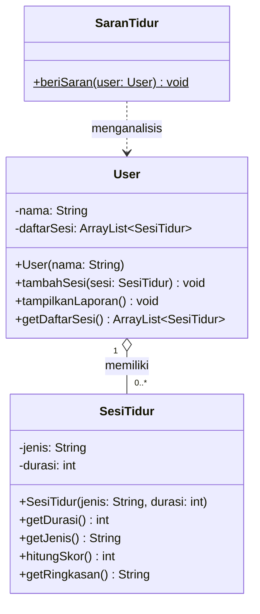

# Sleep Habit Tracker 
**Sistem Manajemen Kebiasaan Tidur berbasis OOP - Java**

---

## Deskripsi Kasus

Hampir semua orang punya masalah tidur — ada yang sering begadang, ada yang tidur siang terlalu lama, ada juga yang power nap-nya malah jadi tidur 3 jam. Tapi jarang ada yang sadar seberapa berantakan pola tidurnya.

Program ini mensimulasikan **Sleep Habit Tracker**: sebuah sistem yang mencatat sesi-sesi tidur seseorang, mengevaluasi kualitasnya lewat sistem skor, lalu memberikan rekomendasi berdasarkan rata-rata skor keseluruhan.

**Alur program:**
1. User memasukkan nama
2. User mencatat 3 sesi tidur (jenis + durasi)
3. Sistem menampilkan laporan per sesi beserta skor dan keterangan
4. Sistem memberi rekomendasi akhir berdasarkan rata-rata skor

---

## Class Diagram



**Penjelasan relasi:**
- `User o-- SesiTidur` → **Aggregation**: User memiliki daftar sesi tidur, tapi objek `SesiTidur` dibuat di luar `User` (di `Main`) sehingga bisa berdiri sendiri.
- `SaranTidur ..> User` → **Dependency**: `SaranTidur` bergantung pada `User` hanya saat method `beriSaran()` dipanggil, bukan menyimpannya sebagai atribut.

---

## Kode Program Java

### `Main.java`
```java
import java.util.Scanner;

public class Main {
    public static void main(String[] args) {
        Scanner input = new Scanner(System.in);

        System.out.print("Masukkan nama kamu: ");
        String nama = input.nextLine();

        User user = new User(nama);

        for (int i = 1; i <= 3; i++) {
            System.out.println("\nSesi ke-" + i);

            System.out.println("Pilih jenis tidur:");
            System.out.println("1. Tidur Siang");
            System.out.println("2. Tidur Malam");
            System.out.println("3. Tidur Nyantai");

            System.out.print("Pilihan (1/2/3): ");
            int pilihan = input.nextInt();
            input.nextLine();

            String jenis = "";
            if (pilihan == 1) jenis = "Tidur Siang";
            else if (pilihan == 2) jenis = "Tidur Malam";
            else if (pilihan == 3) jenis = "Tidur Nyantai";
            else jenis = "Tidak Diketahui";

            System.out.print("Durasi (menit): ");
            int durasi = input.nextInt();
            input.nextLine();

            SesiTidur sesi = new SesiTidur(jenis, durasi);
            user.tambahSesi(sesi);
        }

        System.out.println("\n=====================");
        user.tampilkanLaporan();

        System.out.println("\nRekomendasi:");
        SaranTidur.beriSaran(user);

        input.close();
    }
}
```

### `User.java`
```java
import java.util.ArrayList;

public class User {
    private String nama;
    private ArrayList<SesiTidur> daftarSesi;

    public User(String nama) {
        this.nama = nama;
        this.daftarSesi = new ArrayList<>();
    }

    public void tambahSesi(SesiTidur sesi) {
        daftarSesi.add(sesi);
    }

    public void tampilkanLaporan() {
        System.out.println("Laporan Tidur: " + nama);
        for (SesiTidur s : daftarSesi) {
            System.out.println(s.getRingkasan());
        }
    }

    public ArrayList<SesiTidur> getDaftarSesi() {
        return daftarSesi;
    }
}
```

### `SesiTidur.java`
```java
public class SesiTidur {
    private String jenis;
    private int durasi;

    public SesiTidur(String jenis, int durasi) {
        this.jenis = jenis;
        this.durasi = durasi;
    }

    public int getDurasi() {
        return durasi;
    }

    public String getJenis() {
        return jenis;
    }

    public int hitungSkor() {
        if (jenis.equalsIgnoreCase("Tidur Nyantai")) {
            if (durasi >= 10 && durasi <= 30) return 100;
            else if (durasi <= 60) return 70;
            else return 40;
        }

        if (durasi >= 420 && durasi <= 540) return 100;
        else if (durasi >= 360) return 80;
        else if (durasi >= 180) return 60;
        else return 30;
    }

    public String getRingkasan() {
        int skor = hitungSkor();
        String keterangan = "";

        if (skor == 100) {
            keterangan = "Udah ideal, badan kamu dapet recovery yang baik.";
        } else if (skor >= 80) {
            keterangan = "Lumayan oke, tinggal dibenerin dikit.";
        } else if (skor >= 60) {
            keterangan = "Masih kurang, coba benerin waktu tidur lagi ya.";
        } else {
            keterangan = "Kurang banget, hayoo tidur berlebihan maupun kekurangan ga baik yaa.";
        }

        return jenis + " | " + durasi + " menit | Skor: " + skor + "\n " + keterangan;
    }
}
```

### `SaranTidur.java`
```java
public class SaranTidur {

    public static void beriSaran(User user) {
        int total = 0;
        int jumlah = 0;

        for (SesiTidur s : user.getDaftarSesi()) {
            total += s.hitungSkor();
            jumlah++;
        }

        int rata = total / jumlah;

        System.out.println("Skor rata-rata: " + rata);

        if (rata >= 85) {
            System.out.println("Tidurmu udah bagus, tinggal dijaga aja konsistensinya.");
        } else if (rata >= 70) {
            System.out.println("Lumayan oke, tapi masih bisa dibenerin dikit.");
        } else if (rata >= 50) {
            System.out.println("Agak berantakan, coba atur jam tidur lagi.");
        } else {
            System.out.println("Ini sih udah chaos, badan kamu butuh istirahat serius.");
        }
    }
}
```

---

## Screenshot Output
Ouput Skor Lumayan

```
Masukkan nama kamu: Rifqi

Sesi ke-1
Pilih jenis tidur:
1. Tidur Siang
2. Tidur Malam
3. Tidur Nyantai
Pilihan (1/2/3): 2
Durasi (menit): 480

Sesi ke-2
Pilih jenis tidur:
1. Tidur Siang
2. Tidur Malam
3. Tidur Nyantai
Pilihan (1/2/3): 3
Durasi (menit): 20

Sesi ke-3
Pilih jenis tidur:
1. Tidur Siang
2. Tidur Malam
3. Tidur Nyantai
Pilihan (1/2/3): 1
Durasi (menit): 90

=====================
Laporan Tidur: Rifqi
Tidur Malam | 480 menit | Skor: 100
 Udah ideal, badan kamu dapet recovery yang baik.
Tidur Nyantai | 20 menit | Skor: 100
 Udah ideal, badan kamu dapet recovery yang baik.
Tidur Siang | 90 menit | Skor: 30
 Kurang banget, hayoo tidur berlebihan maupun kekurangan ga baik yaa.

Rekomendasi:
Skor rata-rata: 76
Lumayan oke, tapi masih bisa dibenerin dikit.
```

---

## Prinsip-Prinsip OOP yang Diterapkan

### 1. Encapsulation
Semua atribut di kelas `User` dan `SesiTidur` dideklarasikan sebagai `private`. Akses ke data dilakukan lewat method getter seperti `getDurasi()`, `getJenis()`, dan `getDaftarSesi()`. Ini mencegah data dimodifikasi langsung dari luar kelas.

### 2. Abstraction
Kelas `SesiTidur` menyembunyikan detail logika penghitungan skor di dalam method `hitungSkor()`. Pemanggil (seperti `SaranTidur`) cukup tahu bahwa skor bisa didapat tanpa perlu tahu algoritma di dalamnya.

### 3. Single Responsibility Principle
Setiap kelas punya satu tanggung jawab yang jelas:
- `User` → menyimpan dan menampilkan data pengguna
- `SesiTidur` → menyimpan data satu sesi tidur dan mengevaluasinya
- `SaranTidur` → khusus menganalisis dan memberi rekomendasi
- `Main` → hanya mengatur alur input/output

### 4. Object Composition
`User` tidak mewarisi `SesiTidur`, tapi **memiliki** koleksi `SesiTidur` via `ArrayList`. Ini adalah pendekatan komposisi — hubungan *"has-a"* bukan *"is-a"*.

---

## Keunikan Program

Program ini punya beberapa hal yang membedakannya:

**Domain yang tidak biasa.** Kebanyakan tugas OOP mengambil tema toko, perpustakaan, atau ATM. Sleep Tracker adalah domain yang dekat dengan kehidupan sehari-hari mahasiswa tapi hampir tidak pernah dijadikan studi kasus OOP.

**Sistem skor yang sadar konteks.** Tidur Nyantai (power nap) punya standar penilaian yang berbeda dengan Tidur Malam atau Tidur Siang. Ini mencerminkan kondisi nyata — 20 menit power nap itu ideal, tapi 20 menit tidur malam jelas tidak cukup. Logika ini dikapsulasi rapi di dalam `hitungSkor()`.

**Feedback yang conversational.** Keterangan yang muncul tidak kaku seperti "Status: BAIK". Pesannya ditulis dengan nada santai yang terasa seperti obrolan, bukan laporan medis.
