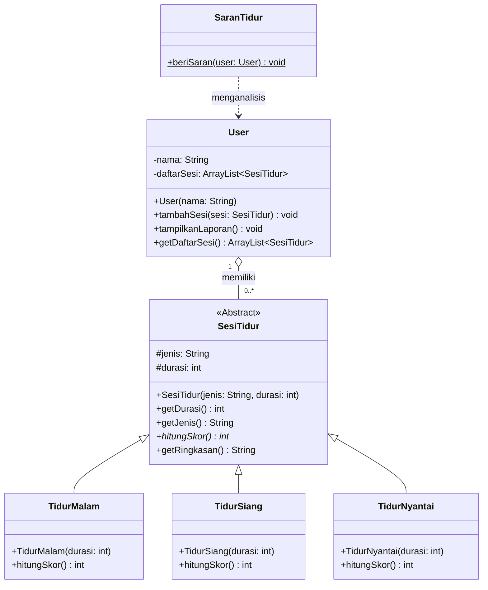
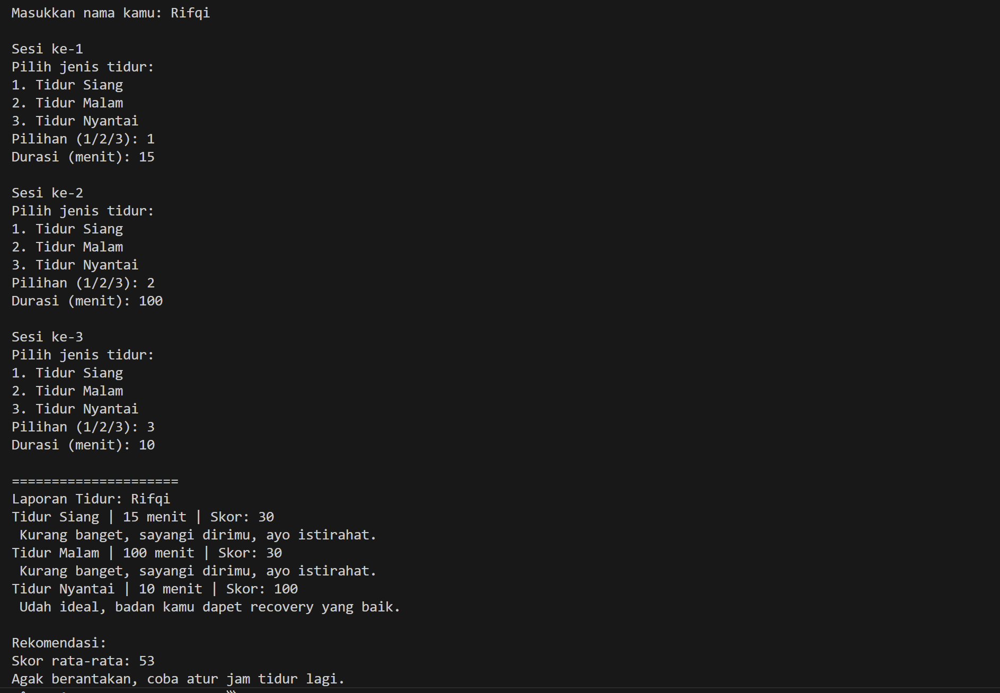
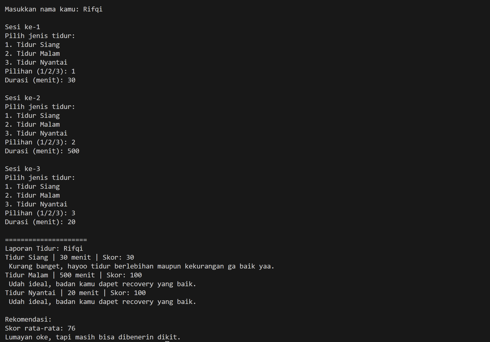

# Sleep Habit Tracker
**Sistem Manajemen Kebiasaan Tidur berbasis OOP - Java**

---

## Deskripsi Kasus

Hampir semua orang punya masalah tidur, ada yang sering begadang, ada yang tidur siang terlalu lama, ada juga yang rebahan santai malah jadi tidur 3 jam. Tapi jarang ada yang sadar seberapa berantakan pola tidurnya.

Program ini mensimulasikan **Sleep Habit Tracker**, sebuah sistem yang mencatat sesi-sesi tidur seseorang, mengevaluasi kualitasnya lewat sistem skor, lalu memberikan rekomendasi berdasarkan rata rata skor keseluruhan.

**Alur program:**
1. User memasukkan nama
2. User mencatat 3 sesi tidur (jenis + durasi)
3. Sistem menampilkan laporan per sesi beserta skor dan keterangan
4. Sistem memberi rekomendasi akhir berdasarkan rata rata skor

---

## Class Diagram



**Penjelasan relasi:**
- `SesiTidur <|-- TidurMalam/TidurSiang/TidurNyantai` → **Inheritance**: ketiga subclass mewarisi atribut dan method dari `SesiTidur`
- `User o-- SesiTidur` → **Aggregation**: User memiliki daftar sesi tidur, tapi objek `SesiTidur` dibuat di luar `User` sehingga bisa berdiri sendiri
- `SaranTidur ..> User` → **Dependency**: `SaranTidur` bergantung pada `User` hanya saat method `beriSaran()` dipanggil

---

## Kode Program Java

### `SesiTidur.java`
```java
public abstract class SesiTidur {
    protected String jenis;
    protected int durasi;

    public SesiTidur(String jenis, int durasi) {
        this.jenis = jenis;
        this.durasi = durasi;
    }

    public int getDurasi() {
        return durasi;
    }

    public String getJenis() {
        return jenis;
    }

    public abstract int hitungSkor();

    public String getRingkasan() {
        int skor = hitungSkor();
        String keterangan = "";

        if (skor == 100) {
            keterangan = "Udah ideal, badan kamu dapet recovery yang baik.";
        } else if (skor >= 80) {
            keterangan = "Lumayan oke, tinggal dibenerin dikit.";
        } else if (skor >= 60) {
            keterangan = "Masih kurang, coba benerin waktu tidur lagi ya.";
        } else {
            keterangan = "Kurang banget, hayoo tidur berlebihan maupun kekurangan ga baik yaa.";
        }

        return jenis + " | " + durasi + " menit | Skor: " + skor + "\n " + keterangan;
    }
}
```

### `TidurMalam.java`
```java
public class TidurMalam extends SesiTidur {

    public TidurMalam(int durasi) {
        super("Tidur Malam", durasi);
    }

    @Override
    public int hitungSkor() {
        if (durasi >= 420 && durasi <= 540) return 100;
        else if (durasi >= 360) return 80;
        else if (durasi >= 180) return 60;
        else return 30;
    }
}
```

### `TidurSiang.java`
```java
public class TidurSiang extends SesiTidur {

    public TidurSiang(int durasi) {
        super("Tidur Siang", durasi);
    }

    @Override
    public int hitungSkor() {
        if (durasi >= 420 && durasi <= 540) return 100;
        else if (durasi >= 360) return 80;
        else if (durasi >= 180) return 60;
        else return 30;
    }
}
```

### `TidurNyantai.java`
```java
public class TidurNyantai extends SesiTidur {

    public TidurNyantai(int durasi) {
        super("Tidur Nyantai", durasi);
    }

    @Override
    public int hitungSkor() {
        if (durasi >= 10 && durasi <= 30) return 100;
        else if (durasi <= 60) return 70;
        else return 40;
    }
}
```

### `User.java`
```java
import java.util.ArrayList;

public class User {
    private String nama;
    private ArrayList<SesiTidur> daftarSesi;

    public User(String nama) {
        this.nama = nama;
        this.daftarSesi = new ArrayList<>();
    }

    public void tambahSesi(SesiTidur sesi) {
        daftarSesi.add(sesi);
    }

    public void tampilkanLaporan() {
        System.out.println("Laporan Tidur: " + nama);
        for (SesiTidur s : daftarSesi) {
            System.out.println(s.getRingkasan());
        }
    }

    public ArrayList<SesiTidur> getDaftarSesi() {
        return daftarSesi;
    }
}
```

### `SaranTidur.java`
```java
public class SaranTidur {

    public static void beriSaran(User user) {
        int total = 0;
        int jumlah = 0;

        for (SesiTidur s : user.getDaftarSesi()) {
            total += s.hitungSkor();
            jumlah++;
        }

        int rata = total / jumlah;

        System.out.println("Skor rata-rata: " + rata);

        if (rata >= 85) {
            System.out.println("Tidurmu udah bagus, tinggal dijaga aja konsistensinya.");
        } else if (rata >= 70) {
            System.out.println("Lumayan oke, tapi masih bisa dibenerin dikit.");
        } else if (rata >= 50) {
            System.out.println("Agak berantakan, coba atur jam tidur lagi.");
        } else {
            System.out.println("Ini sih udah chaos, badan kamu butuh istirahat serius.");
        }
    }
}
```

### `Main.java`
```java
import java.util.Scanner;

public class Main {
    public static void main(String[] args) {
        Scanner input = new Scanner(System.in);

        System.out.print("Masukkan nama kamu: ");
        String nama = input.nextLine();

        User user = new User(nama);

        for (int i = 1; i <= 3; i++) {
            System.out.println("\nSesi ke-" + i);
            System.out.println("Pilih jenis tidur:");
            System.out.println("1. Tidur Siang");
            System.out.println("2. Tidur Malam");
            System.out.println("3. Tidur Nyantai");

            System.out.print("Pilihan (1/2/3): ");
            int pilihan = input.nextInt();
            input.nextLine();

            System.out.print("Durasi (menit): ");
            int durasi = input.nextInt();
            input.nextLine();

            SesiTidur sesi;
            if (pilihan == 1) sesi = new TidurSiang(durasi);
            else if (pilihan == 2) sesi = new TidurMalam(durasi);
            else if (pilihan == 3) sesi = new TidurNyantai(durasi);
            else sesi = new TidurMalam(durasi);

            user.tambahSesi(sesi);
        }

        System.out.println("\n=====================");
        user.tampilkanLaporan();

        System.out.println("\nRekomendasi:");
        SaranTidur.beriSaran(user);

        input.close();
    }
}
```

---

## Screenshot Output
*Output Skor Lumayan*





*Output Skor Jelek*




---

## Prinsip-Prinsip OOP yang Diterapkan

### 1. Encapsulation
Semua atribut di kelas `User` dan `SesiTidur` dideklarasikan `private` atau `protected`. Akses ke data dilakukan lewat method getter seperti `getDurasi()`, `getJenis()`, dan `getDaftarSesi()`. Data tidak bisa dimodifikasi langsung dari luar kelas.

### 2. Inheritance
`TidurMalam`, `TidurSiang`, dan `TidurNyantai` mewarisi atribut `jenis`, `durasi`, dan method `getRingkasan()` dari abstract class `SesiTidur`. Tidak perlu menulis ulang logika yang sama di tiap subclass.

### 3. Polymorphism
Ketiga subclass meng-override method `hitungSkor()` dengan standar penilaian masing-masing. Di `User` dan `SaranTidur`, semua sesi diperlakukan sebagai `SesiTidur` — tapi saat `hitungSkor()` dipanggil, Java otomatis menjalankan versi yang sesuai dengan tipe aslinya. Ini adalah runtime polymorphism.

### 4. Abstraction
`SesiTidur` dideklarasikan sebagai `abstract class` dengan method abstrak `hitungSkor()`. Ini memaksa setiap subclass untuk mengimplementasikan logika skoringnya sendiri, sekaligus menyembunyikan detail implementasi dari pemanggil.

---

## Keunikan Program

**Standar skor berbasis data nyata.** Ambang 420–540 menit (7–9 jam) adalah rekomendasi tidur orang dewasa yang punya dasar dari literatur kesehatan. Tidur santai(rehat sejenak) ideal 10–30 menit juga sama. Logika skoringnya bukan angka sembarang.

**Dua lapisan evaluasi.** Setiap sesi dapat feedback individual lewat `getRingkasan()`, lalu ada rekomendasi agregat dari `SaranTidur`. Bukan langsung loncat ke kesimpulan akhir.

**Inheritance yang kontekstual.** Pemisahan `TidurMalam`, `TidurSiang`, `TidurNyantai` bukan sekadar biar ada inheritance — memang logika skoringnya beda. Power nap 20 menit itu ideal, tapi tidur malam 20 menit jelas tidak cukup. Struktur kelas mencerminkan perbedaan nyata ini.

**`SaranTidur` sebagai static utility class.** Kelas ini tidak perlu diinstansiasi — murni utility. Ini pilihan desain yang disengaja, berbeda dari kebanyakan tugas yang cenderung membuat semua kelas menjadi objek.
